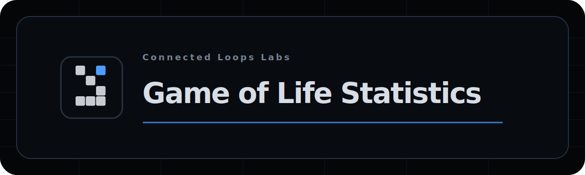

# Game of Life



A small Conway's Game of Life playground for the browser.

It has a TypeScript UI, a canvas renderer, and a Rust WebAssembly engine for the simulation. If WASM does not load, it falls back to the TypeScript engine.

## What you can do

- Run, pause, clear, and randomize the world
- Paint cells by clicking or dragging on the canvas
- Change the grid size, cell size, speed, density, wrapping, and grid overlay
- Switch between a few rule sets, including Conway, HighLife, Seeds, and Day & Night
- Drop in common Life patterns from a searchable pattern library
- Toggle state colors to see births, survivors, and recently dead cells
- Collapse the controls when you just want the canvas

## Keyboard shortcuts

- `Space` or `K`: run / pause
- `R`: randomize the world
- `C`: clear the world
- `[` / `]`: slower / faster
- `F`: collapse or expand the controls
- `S`: show or hide the stats panel

## Running it locally

You need Bun, Rust, and `wasm-pack`.

```bash
bun install
bun run dev
```

For a production build:

```bash
bun run build
```

That rebuilds the Rust WASM package, then builds the Vite app.

## Tests

```bash
bun test
cargo test --manifest-path wasm-engine/Cargo.toml
```

## Notices

Developed by Mustafa Mohsen.

Copyright (c) 2026 Mustafa Mohsen. Licensed under the MIT License; see [LICENSE](LICENSE).
