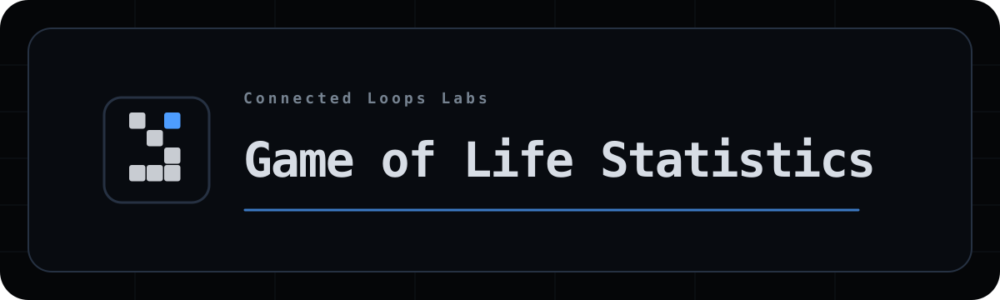

# Game of Life



A small Conway's Game of Life playground for the browser.

It has a TypeScript UI, a canvas renderer, and a Rust WebAssembly engine for the simulation. If WASM does not load, it falls back to the TypeScript engine.

## What you can do

- Run, pause, clear, and randomize the world
- Paint cells by clicking or dragging on the canvas
- Change the grid size, cell size, speed, density, wrapping, and grid overlay
- Switch between a few rule sets, including Conway, HighLife, Seeds, and Day & Night
- Drop in common Life patterns from a searchable pattern library
- Toggle state colors to see births, survivors, and recently dead cells
- Collapse the controls when you just want the canvas

## Keyboard shortcuts

- `Space` or `K`: run / pause
- `R`: randomize the world
- `C`: clear the world
- `←` / `→` or `,` / `.`: step backward / forward
- `[` / `]`: slower / faster
- `F`: collapse or expand the controls
- `S`: show or hide the stats panel

## Running it locally

You need Bun, Rust, and `wasm-pack`.

```bash
bun install
bun run dev
```

For a production build:

```bash
bun run build
```

That rebuilds the Rust WASM package, then builds the Vite app.

## Deploying to Cloudflare Workers

This repository includes `wrangler.toml` and a GitHub Actions workflow for Cloudflare Workers Static Assets.

One-time Cloudflare setup:

1. Create a Cloudflare API token with Workers deployment permissions.
2. Find your Cloudflare account ID in the Cloudflare dashboard.
3. Add these GitHub repository secrets:
   - `CLOUDFLARE_API_TOKEN`
   - `CLOUDFLARE_ACCOUNT_ID`

Deploy from your machine:

```bash
bun install
bun run deploy:cloudflare
```

Deploy from CI:

- Push to `main`, or run the `Deploy to Cloudflare Workers` workflow manually from GitHub Actions.
- The workflow installs Bun and Rust, builds the WASM/Vite app, then runs `wrangler deploy`.

The Worker name is configured in `wrangler.toml` as `game-of-life`. Change that `name` before deploying if you want a different `*.workers.dev` subdomain.

## Tests

```bash
bun test
cargo test --manifest-path wasm-engine/Cargo.toml
```

## Notices

Developed by Mustafa Mohsen.

Copyright (c) 2026 Mustafa Mohsen. Licensed under the MIT License; see [LICENSE](LICENSE).
